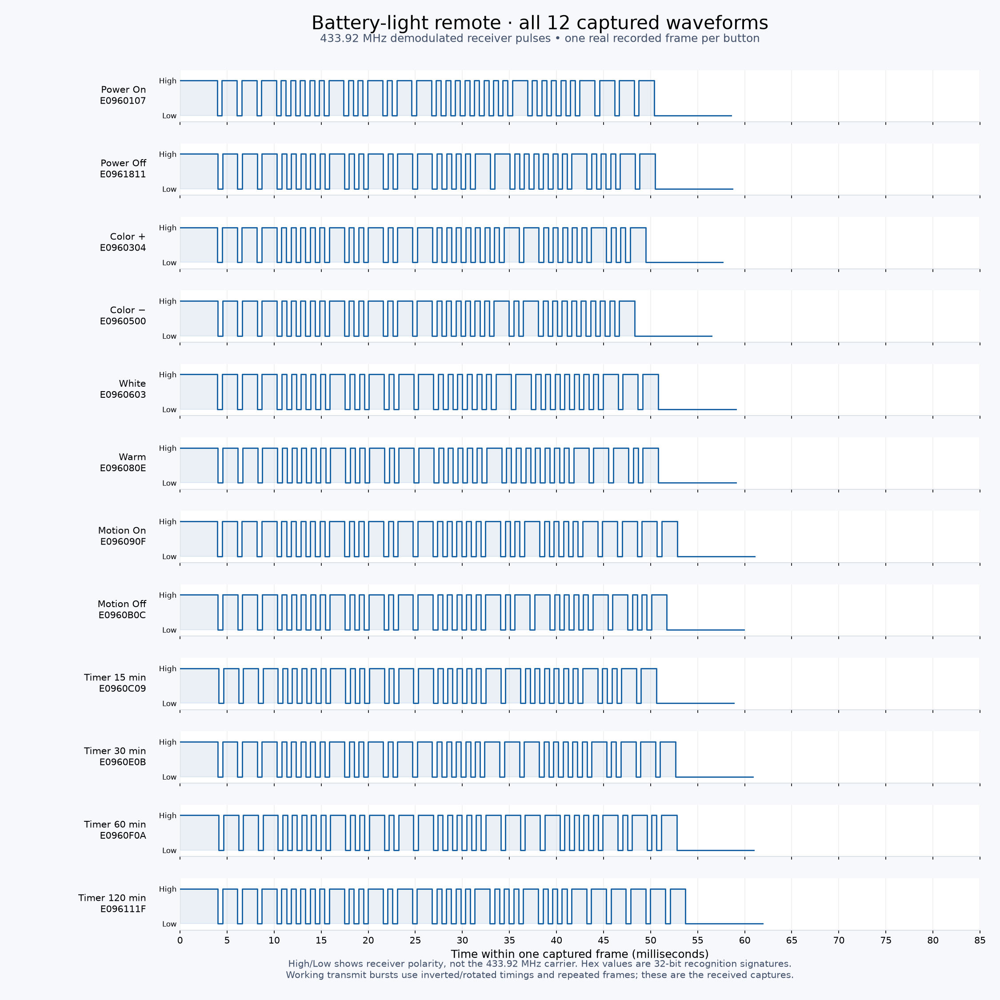

# Athom battery-light guard

ESPHome firmware overlay for an Athom ESP32 RF/IR Remote. It listens for a specific 433.92 MHz battery-light remote and sends Power Off **five minutes after Power On**, unless a native timer button was heard. The countdown runs on the Athom; Home Assistant is optional for diagnostics.

Current version: **battery-guard-1.3**, built with **ESPHome 2026.9.0**.

## AI creation and human direction

The custom firmware overlay, RF decoder, tests, and project documentation were created with **OpenAI Codex** under the direction of **Chris McGhan**. Chris defined the requirements, operated the physical remote, and confirmed the observed light behavior during hardware testing. The underlying ESPHome platform and Athom configuration are third-party work credited below.

This AI contribution includes the initial firmware publication in commit `ba76704753258e49e1a84ba5103f4686c98957ee`, even though that commit originally listed only Chris as its author. AI-assisted commits can record Codex's contribution with this Git trailer:

```text
Co-authored-by: Codex <noreply@openai.com>
```

See [GitHub's co-author documentation](https://docs.github.com/en/pull-requests/how-tos/commit-changes/creating-a-commit-with-multiple-authors). Commit attribution and GitHub's repository Contributors display are separate; a trailer does not guarantee a particular sidebar listing.

## Behavior

- Power On starts/restarts a 300-second fallback from that press.
- The first 10 seconds display “Awaiting timer selection”; the countdown is already running.
- Any native 15/30/60/120-minute timer command cancels the fallback, including a later timer selection.
- Power Off cancels it. Color, white, warm, and motion commands do not alter it. Motion activation is outside the intended use: automatic motion activation cannot start this fallback.
- Repeated copies of the same command within 800 ms are deduplicated.
- On expiry, transmit the captured four-frame Power Off burst.
- No countdown is restored after reboot. Wi-Fi/API disconnection does not intentionally reboot the device.

This recognizes one captured remote command set, not all 433 MHz lights. Carrier frequency alone does not establish compatibility. A product/protocol identification has not been confirmed.

## Files

- `guard.h`: allocation-free pulse decoder and countdown state machine.
- `guard.yaml`: ESPHome overlay, Off waveform, and Home Assistant diagnostic entities.
- `fetch_stock.py`: fetches and verifies Athom's pinned configuration, generating `stock.yaml` with a pinned Flash_comp dependency.
- `samples/frames.json`: one recorded frame per button, stripped of capture metadata.
- `test_guard.cpp`, `test_captures.py`: state-machine and recorded-waveform tests.

The program retains upstream RF/IR and Bluetooth proxy features. It removes the vendor firmware-update entity because installing stock firmware would remove this overlay.

## Build and install

```sh
python3 -m venv .venv
. .venv/bin/activate
pip install -r requirements.txt
python3 fetch_stock.py
esphome config guard.yaml
esphome compile guard.yaml
esphome upload guard.yaml --device YOUR_ATHOM_IP
```

Provision the device's Wi-Fi using the supported Athom/ESPHome provisioning flow. No Wi-Fi credentials, API credentials, or device-specific addresses are supplied here. Confirm your hardware is the compatible ESP32 Athom RF/IR Remote before installing. Upload only to your intended device; OTA restarts it and clears any active fallback.

## Tests and verification

```sh
python3 test_captures.py
```

Requires a C++17 compiler named `c++` on PATH. Tests cover the five-minute boundary, cancellation by all four timers and Off, repeated frames, restart, unrelated commands, clock rollover, twelve captured command signatures, truncation, and invalid pulses.

Live hardware testing confirmed remote Power On recognition, native Timer 30 cancellation, and a complete physical automatic-shutoff cycle with the earlier 15-minute version. Version 1.3 changes the deadline and diagnostic text to five minutes; its boundary tests pass, but a complete five-minute physical cycle has not yet been documented. Repeated-trial and range reliability remain unmeasured.

## Diagnostics and limitations

Home Assistant receives last command, protection status, last action, remaining seconds, and command count through the ESPHome native API. These describe commands heard/sent, not measured lamp state. The receiver may hear its own Off transmission and then report `Power Off heard` / `Idle`. There is no lamp acknowledgment. Missed RF commands, loss of power, or a reboot can defeat the fallback; this is a convenience feature.

The decoder uses a 6 ms receive gap, folds isolated glitches up to 150 microseconds, and requires a known complete 32-bit signature with leader and trailer. The signature is a recognition convention, not a claim of a fully documented protocol. Transmit timings have different polarity/alignment from the plotted receiver samples.



## Upstream attribution

Base configuration and Flash_comp: [athom-tech/esp32-configs](https://github.com/athom-tech/esp32-configs), pinned at `6181202ed9fe274c3f994112ef3b847f295dd9f4`. These third-party sources are fetched by `fetch_stock.py` and during the build and are not vendored here. ESPHome: https://github.com/esphome/esphome.
